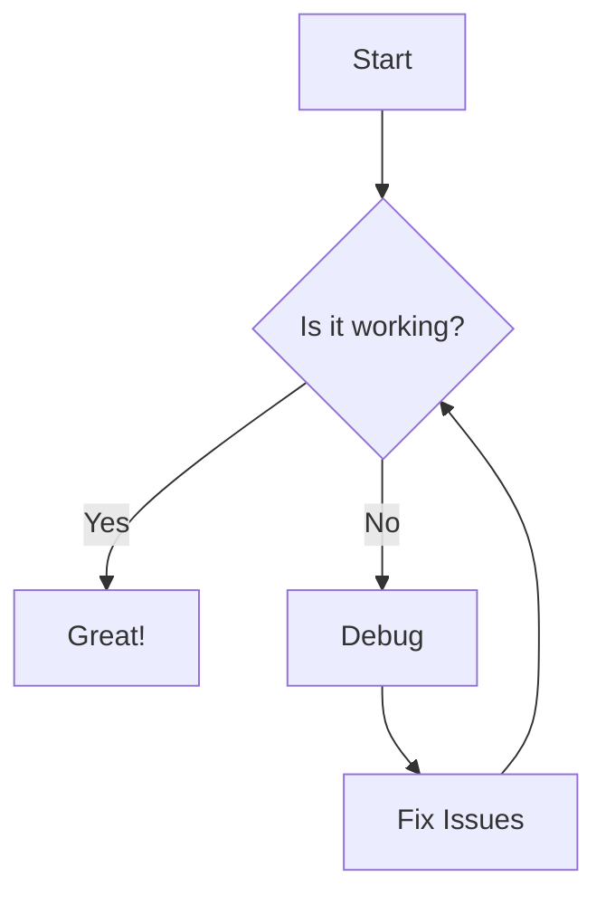

# Advanced Features

This page demonstrates advanced features of Blog Engine MD.

## Embeds

You can embed external content:

::youtube[dQw4w9WgXcQ]

## Mermaid Diagrams

## Admonitions

:::note
This is a note admonition.
:::

:::warning
This is a warning admonition.
:::

:::tip
This is a tip admonition.
:::

## Tables

| Feature | Status | Description |
|---------|--------|-------------|
| Wiki Links | ✅ | Link pages with [[syntax]] |
| Graph View | ✅ | Visualize page connections |
| Embeds | ✅ | YouTube, Vimeo, etc. |
| Images | ✅ | Responsive image handling |

## Cross-References

- Back to [[Getting Started]]
- Read [[My First Post]]
- Learn about the [[About|project]]
